# git merge & git rebase test

## git merge

### git-merge-no-conflict-1

1. 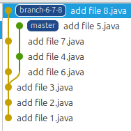  
1. 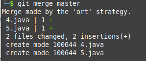  
1. 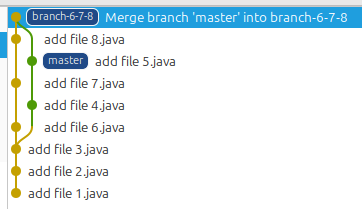  
1. 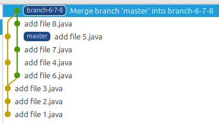  
1. 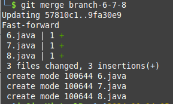  
1. 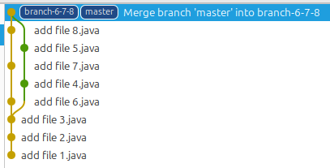  

### git-merge-no-conflict-2

1.   
1. 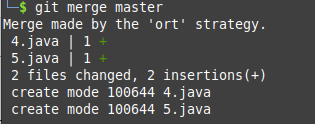  
1. 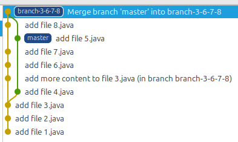  
1. 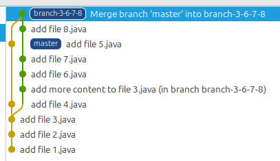  
1. 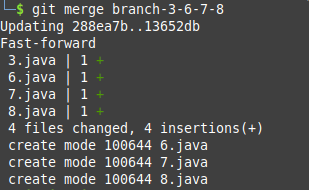  
1. 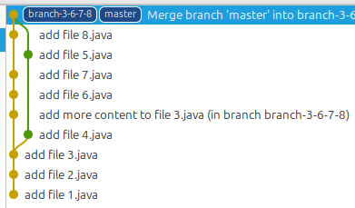  

### git-merge-conflict

1. 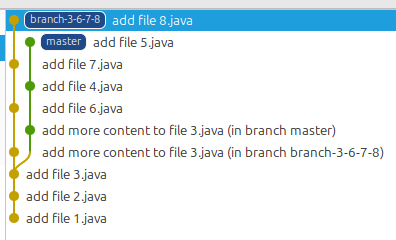  
1. 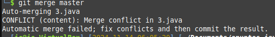  
1. 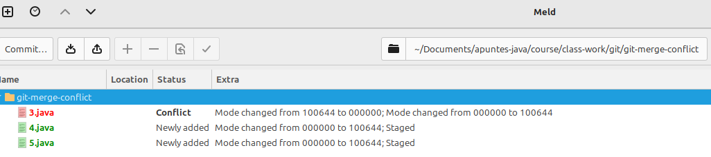  
1.   
1. 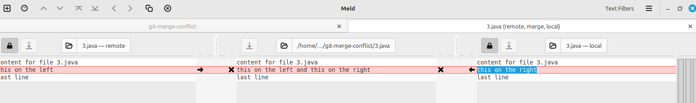  
1. 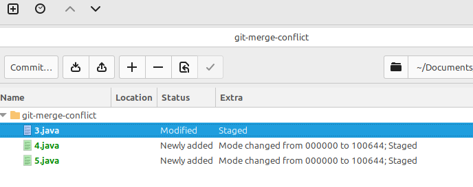  
1. 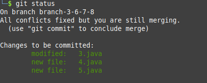  
1. 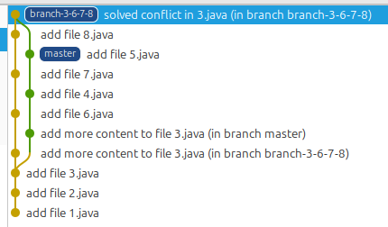  
1. 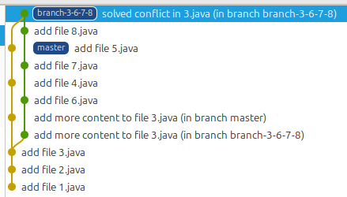  
1. 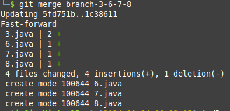  
1.   

## git rebase

### git-rebase-no-conflict-1

1. 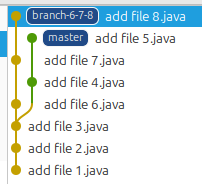  
1. 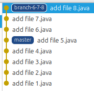  
1. 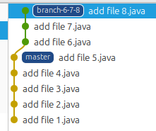  
1. 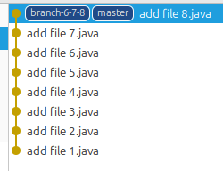  

### git-rebase-no-conflict-2

1. 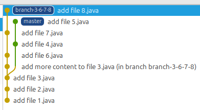  
1. 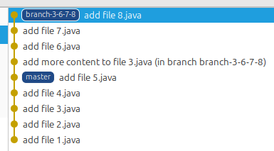  
1. 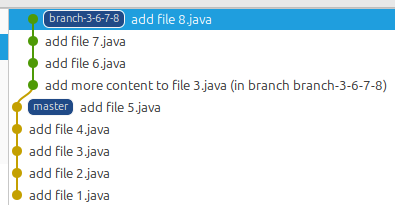  
1. 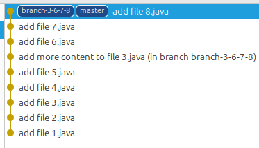  

### git-rebase-with-conflict

1. 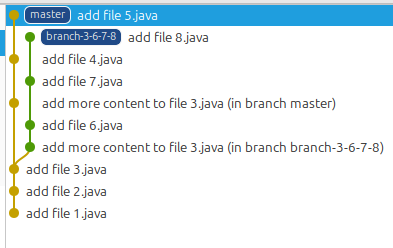  
1. 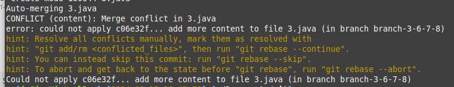  
1. 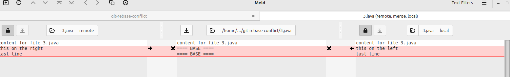  
1. 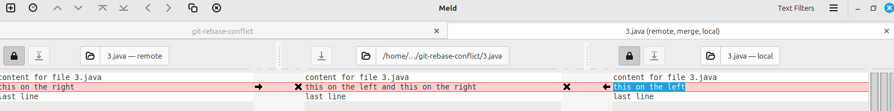  
1. 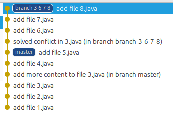  
1. 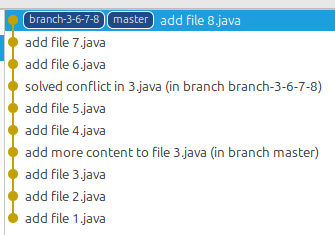  
